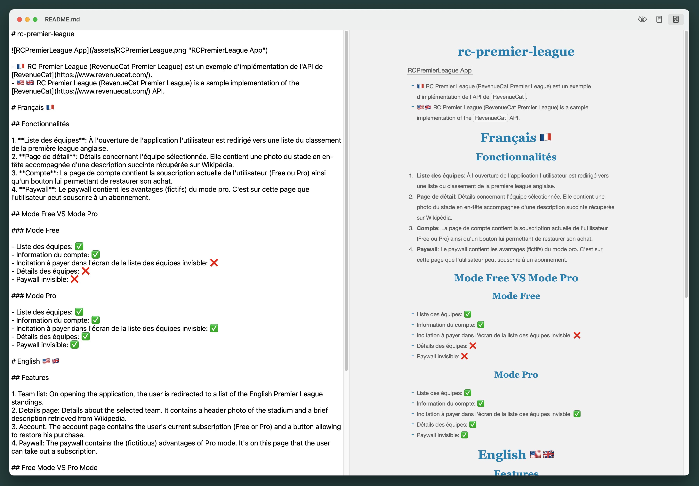

# mac-markdown
A Markdown editor MacOS application

The goal of this application is to discover MacOS app development thanks to the kodeco book : [SwiftUI by Tutorials](https://www.kodeco.com/books/swiftui-by-tutorials/v4.0 "SwiftUI by Tutorials").

The app contains the following features :
- Edit markdown
- Live preview
- Change the editor font size inside **Settings** menu.
- A **Markdown Cheatsheet** section inside the **help** menu containing a [Markdown Cheatsheet](https://github.com/adam-p/markdown-here/wiki/Markdown-Cheatsheet "Markdown Cheatsheet"). Shortcut : **Command + /**.
- A **Stylesheet** menu containing different markdown themes.
- A toolbar with the following modes: hide the rendering (editor mode), see the markdown in html, see the markdown rendered.